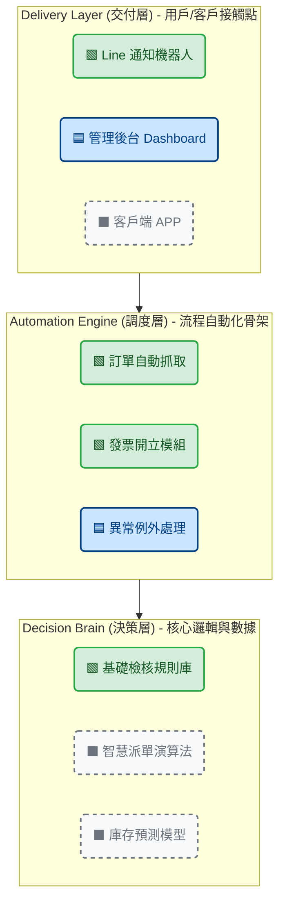

## 🧩 【全階段通用】專案里程碑與決策匯報母版_高階主管報告用

### 0. 封面：專案定位卡

* **主標：** 《[專案名稱] 建置進度匯報 - [當前階段：Phase X]》
* **副標：** 商業目標：[一句話描述本階段核心價值，如：完成核心數據基礎建設]
* **報告人：** ＿＿＿＿ 
* **日期：** 202X/XX/XX

---

### 1️⃣ 專案全景圖（The Big Picture）

*這頁永遠不變，用來提醒大家「我們正走在哪條路上」。*

* **終極願景：** 建立一套[描述最終狀態，如：全自動化供應鏈中樞]。
* **階段路徑圖 (Roadmap Overview)：**
* **Phase 1 [本階段]：** 基礎架構與核心流程度 (Foundation) ← **We are here**
* **Phase 2：** 外部系統對接與擴充 (Expansion)
* **Phase 3：** 數據智慧與預測模型 (Intelligence)

* **本階段核心任務：** 解決 [痛點 A] 與 [痛點 B]，實現 [具體效益]。

---

### 2️⃣ 系統藍圖與落實度（Architecture & Delivery）

* **[架構圖區域]：** 展示三層架構（決策層、調度層、交付層）。
* **狀態標示：**
* ⬛ **灰色（未啟動）：** Phase 2+ 規劃中
* 🟦 **藍色（開發中）：** 結構已完成，測試中
* 🟩 **綠色（已交付）：** **本階段已上線功能**（本次報告重點）

#### 📊 選項一：系統藍圖架構示意 (Mermaid 視覺化)

這張圖展示了一個典型的「自動化中樞」架構。請注意顏色代表的進度含義（對應你的圖例）。

#### 🖥️ 選項二：PPT 實作版型 (可以直接複製文字排版)

在 PPT 中，建議使用「堆疊方塊圖」。最底層是地基，最上層是屋頂。
請依照下方的版型配置你的 Slide：

#### 【Slide 標題】系統藍圖與落實度 (Architecture & Delivery)

**(圖例 Legend)**
🟩 **已交付 (Done)**：本次 Phase 1 重點成果，已上線運行
🟦 **開發中 (WIP)**：結構已完成，正在進行整合測試
⬛ **規劃中 (Planned)**：預計於 Phase 2/3 啟動

---

#### 【圖表區域】(請在 PPT 中繪製三個大長方形，裡面放小方塊)

**🔺 上層：Delivery Layer (交付層)**

> *直觀介面，讓使用者「有感」*
> [ 🟩 Line 通知機器人 ]   [ 🟦 營運報表 Dashboard ]   [ ⬛ 未來：客戶自助 APP ]

**⬇️ (數據流動)**

**⚙️ 中層：Automation Engine (調度層)**

> *連結斷裂的系統，讓流程「流動」*
> [ 🟩 ERP 訂單同步器 ]   [ 🟩 第三方物流 API 串接 ]   [ 🟦 異常單自動分流 ]

**⬇️ (規則調用)**

**🧠 底層：Decision Brain (決策層)**

> *將經驗數據化，讓系統「思考」*
> [ 🟩 標準審核規則引擎 ]   [ ⬛ Phase 2：AI 銷量預測 ]   [ ⬛ Phase 3：動態定價模型 ]

---

### 3️⃣ 階段性成果檢核（Status Check）

*不談苦勞，只對焦「可交付項目」。*

| 關鍵模組 (Key Modules) | 商業價值 (Impact) | 狀態 | 預計/實際完成日 |
| --- | --- | --- | --- |
| **模組 A** | 解決 80% 人工操作 | ✅ 已驗收 | MM/DD |
| **模組 B** | 提升資料準確率 | 🧪 UAT 中 | MM/DD |
| **模組 C** | [填寫價值] | ⚠️ 阻礙中 (見下頁) | TBD |

---

### 4️⃣ 風險儀表板（Risk & Health）

*通用格式，不管哪個階段都要誠實面對。*

* **整體健康度：** 🟢 綠燈 / 🟡 黃燈 / 🔴 紅燈
* **關鍵風險 Top 3：**
1. **[技術/時程/資源] 風險：** [描述問題]
* *對策：* [已採取的行動] (Status: 監控中)

2. **[外部/依賴] 風險：** [描述問題]
* *對策：* [已採取的行動] (Status: 已收斂)

---

### 5️⃣ 關鍵決策請求（Decision Matrix - 模組區）

*⚠️ 這是本簡報最核心的一頁。請根據當下情境，從下方 A/B/C 三種模組中**選一張**貼上，其餘刪除。*

#### 【模組 A：規格取捨題】（適用於趕上線、資源不足時）

* **情境：** 為了確保 [日期] 準時上線（Go-Live），建議調整範疇。
* **決策：** 針對 [功能 X]，我們建議採取 **方案 B**。

| 比較維度 | 方案 A：完整開發 (硬做) | 方案 B：分階段上線 (推薦) |
| --- | --- | --- |
| **上線時間** | 延後 N 週 | **準時上線** |
| **風險** | 測試不足，穩定性低 | 需暫時人工處理 |
| **效益** | 功能一次到位 | **核心價值先變現** |

#### 【模組 B：資源追加題】（適用於 Phase 2/3 擴張期）

* **情境：** Phase 1 已驗證成功，為加速 Phase 2，需擴大投入。
* **決策：** 請求批准 [預算/人力/設備] 追加。
* **ROI 分析：** 投入 [成本] → 預計帶來 [效益/節省時間]。

#### 【模組 C：方向確認題】（適用於需求模糊時）

* **情境：** 遇到業務邏輯分歧，技術端需確認業務方向。
* **決策：** 請確認系統邏輯應優先滿足 [規則 A] 還是 [規則 B]？

---

### 6️⃣ 下一步計畫（Next Steps）

* **短期里程碑 (Immediate Actions)：**
* [日期]：完成本次會議決議事項
* [日期]：Phase X 正式上線 / 進入下個 Sprint

* **長期展望 (Outlook)：**
* 預告 Phase X+1 的啟動時間與核心目標。

---

### 7️⃣ 結語（The Anchor）

*一句話定調你的專業價值，建議每階段微調但核心不變。*

> 「我們正在透過標準化的系統迭代，逐步將公司的營運經驗資產化。
> 本次階段性目標的達成，將為 [下一階段目標] 奠定堅實基礎。」

---

### 💡 Global PM 的使用心法：

1. **這是「填空題」不是「作文題」：** 每次報告前，你只需要更新數據、狀態燈號，並選擇第 5 頁的「決策模組」。
2. **維持一致性（Consistency）：** 讓主管習慣看這個版型。當他習慣看到第 4 頁是紅綠燈、第 5 頁是要做決定時，你的會議效率會提升兩倍。
3. **第 5 頁是靈魂：** 如果那次會議平安無事、不需要主管做困難決定，第 5 頁可以改為「需要主管協助協調的事項（Support Needed）」或者直接拿掉，但我建議保留並寫「目前無重大待決策事項」，這本身就是一種強大的信心展示。